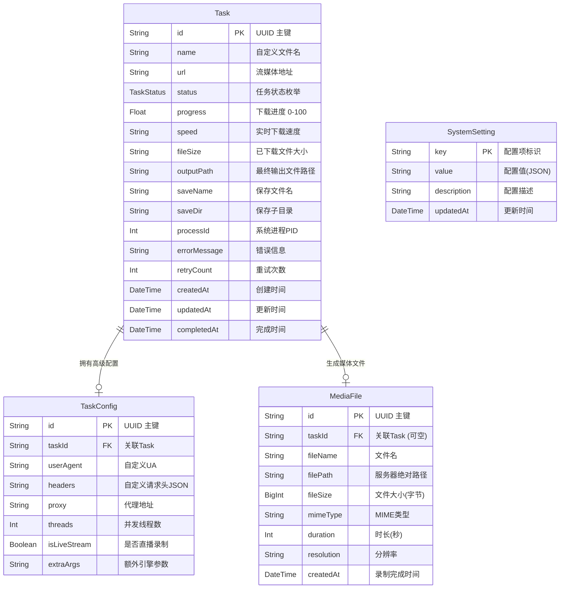
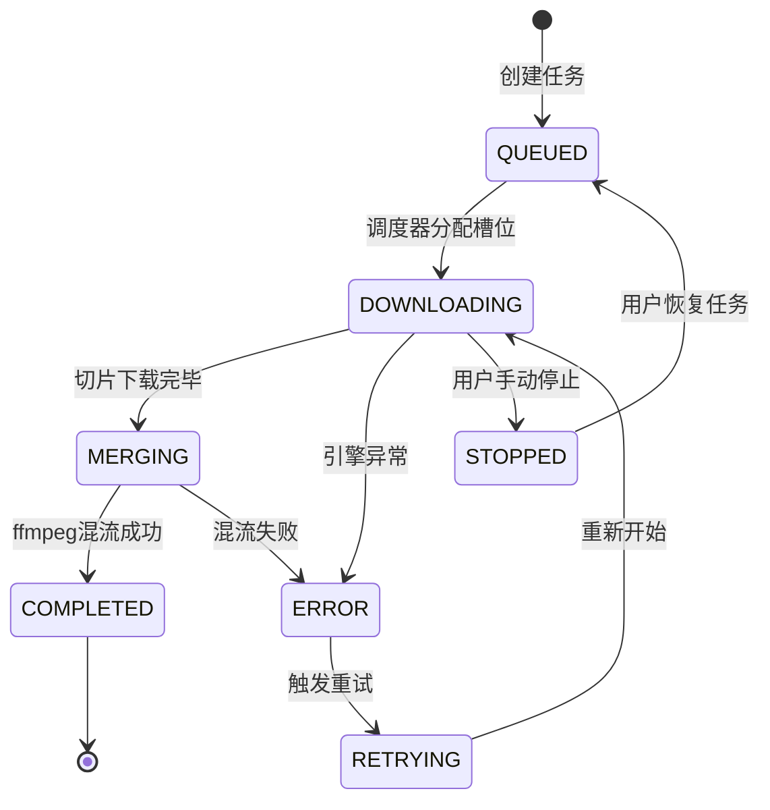

# 数据库架构设计文档

## 1. 概述

本项目采用 **SQLite** 作为数据库，使用 **Prisma ORM** 进行数据模型管理和数据库交互。SQLite 轻量、无需独立服务、适合容器化部署，完美契合本项目"单机部署"的场景。

---

## 2. ER 实体关系图



---

## 3. 数据表详细定义

### 3.1 Task — 录制任务表

核心业务表，存储每一条录制任务的完整生命周期数据。

| 字段 | 类型 | 约束 | 说明 |
|---|---|---|---|
| `id` | `String` | PK, UUID | 主键 |
| `name` | `String` | NOT NULL | 用户自定义的视频文件名 |
| `url` | `String` | NOT NULL | 原始流媒体地址 (M3U8/DASH/ISM) |
| `status` | `Enum(TaskStatus)` | NOT NULL, DEFAULT `QUEUED` | 任务状态 |
| `progress` | `Float` | DEFAULT `0` | 下载进度百分比 (0.0 ~ 100.0) |
| `speed` | `String` | NULLABLE | 当前下载速度，如 `"12.5 MB/s"` |
| `fileSize` | `String` | NULLABLE | 已下载文件大小，如 `"1.2 GB"` |
| `outputPath` | `String` | NULLABLE | 最终输出文件在服务器上的绝对路径 |
| `saveName` | `String` | NULLABLE | 保存时的文件名（不含扩展名） |
| `saveDir` | `String` | NULLABLE | 保存到的子目录路径 |
| `processId` | `Int` | NULLABLE | 底层 `N_m3u8DL-RE` 进程的系统 PID |
| `errorMessage` | `String` | NULLABLE | 任务失败时的错误信息 |
| `retryCount` | `Int` | DEFAULT `0` | 已重试次数 |
| `createdAt` | `DateTime` | DEFAULT `now()` | 任务创建时间 |
| `updatedAt` | `DateTime` | `@updatedAt` | 最后更新时间 |
| `completedAt` | `DateTime` | NULLABLE | 任务完成时间 |

**TaskStatus 枚举**:

| 值 | 含义 | 描述 |
|---|---|---|
| `QUEUED` | 排队中 | 等待可用槽位 |
| `DOWNLOADING` | 下载中 | 引擎正在执行下载 |
| `MERGING` | 合并中 | ffmpeg 正在混流 |
| `COMPLETED` | 已完成 | 下载并混流成功 |
| `ERROR` | 错误 | 引擎报错或进程异常退出 |
| `STOPPED` | 已停止 | 用户手动暂停/停止 |
| `RETRYING` | 重试中 | 自动或手动触发重试 |

**索引设计**:

| 索引名 | 字段 | 类型 | 用途 |
|---|---|---|---|
| `idx_task_status` | `status` | B-Tree | 按状态筛选任务列表 |
| `idx_task_created` | `createdAt` | B-Tree | 按创建时间排序 |
| `idx_task_status_created` | `status, createdAt` | 复合 | 仪表盘统计查询优化 |

---

### 3.2 TaskConfig — 任务高级配置表

将高级、非必填的引擎参数从 Task 表中分离，保持主表简洁。

| 字段 | 类型 | 约束 | 说明 |
|---|---|---|---|
| `id` | `String` | PK, UUID | 主键 |
| `taskId` | `String` | FK → Task.id, UNIQUE | 关联任务 |
| `userAgent` | `String` | NULLABLE | 自定义 User-Agent |
| `headers` | `String` | NULLABLE | 自定义请求头 (JSON 字符串) |
| `proxy` | `String` | NULLABLE | 代理地址，如 `http://127.0.0.1:7890` |
| `threads` | `Int` | DEFAULT `16` | 并发线程数 |
| `isLiveStream` | `Boolean` | DEFAULT `false` | 是否为直播流实时录制 |
| `extraArgs` | `String` | NULLABLE | 传递给引擎的额外命令行参数 |

---

### 3.3 MediaFile — 媒体文件表

独立管理已录制完成的视频文件元信息，支持视频库功能。

| 字段 | 类型 | 约束 | 说明 |
|---|---|---|---|
| `id` | `String` | PK, UUID | 主键 |
| `taskId` | `String` | FK → Task.id, NULLABLE | 关联的源任务（手动导入时为空） |
| `fileName` | `String` | NOT NULL | 文件名，如 `video_001.mp4` |
| `filePath` | `String` | NOT NULL, UNIQUE | 服务器上的绝对路径 |
| `fileSize` | `BigInt` | NOT NULL | 文件大小（字节） |
| `mimeType` | `String` | DEFAULT `"video/mp4"` | MIME 类型 |
| `duration` | `Int` | NULLABLE | 视频时长（秒） |
| `resolution` | `String` | NULLABLE | 分辨率，如 `"1920x1080"` |
| `createdAt` | `DateTime` | DEFAULT `now()` | 文件录入时间 |

---

### 3.4 SystemSetting — 系统配置表

键值对结构存储全局系统配置。

| 字段 | 类型 | 约束 | 说明 |
|---|---|---|---|
| `key` | `String` | PK | 配置项唯一标识 |
| `value` | `String` | NOT NULL | 配置内容（JSON 字符串） |
| `description` | `String` | NULLABLE | 配置项中文描述 |
| `updatedAt` | `DateTime` | `@updatedAt` | 最后修改时间 |

**预置配置项**:

| Key | 默认 Value | 说明 |
|---|---|---|
| `engine.n_m3u8dl_path` | `"/usr/local/bin/N_m3u8DL-RE"` | 引擎可执行文件路径 |
| `engine.ffmpeg_path` | `"/usr/bin/ffmpeg"` | ffmpeg 可执行文件路径 |
| `storage.save_dir` | `"/data/videos"` | 全局默认保存根目录 |
| `task.max_concurrent` | `3` | 最大同时运行任务数 |
| `task.default_threads` | `16` | 默认下载线程数 |
| `task.auto_retry` | `false` | 是否自动重试失败任务 |
| `task.max_retry_count` | `3` | 最大自动重试次数 |

---

## 4. Prisma Schema 定义

```prisma
// schema.prisma

generator client {
  provider = "prisma-client-js"
}

datasource db {
  provider = "sqlite"
  url      = env("DATABASE_URL") // e.g. "file:./stream-recorder.db"
}

enum TaskStatus {
  QUEUED
  DOWNLOADING
  MERGING
  COMPLETED
  ERROR
  STOPPED
  RETRYING
}

model Task {
  id           String      @id @default(uuid())
  name         String
  url          String
  status       TaskStatus  @default(QUEUED)
  progress     Float       @default(0)
  speed        String?
  fileSize     String?
  outputPath   String?
  saveName     String?
  saveDir      String?
  processId    Int?
  errorMessage String?
  retryCount   Int         @default(0)
  createdAt    DateTime    @default(now())
  updatedAt    DateTime    @updatedAt
  completedAt  DateTime?

  config     TaskConfig?
  mediaFile  MediaFile?

  @@index([status])
  @@index([createdAt])
  @@index([status, createdAt])
}

model TaskConfig {
  id           String   @id @default(uuid())
  taskId       String   @unique
  userAgent    String?
  headers      String?  // JSON string
  proxy        String?
  threads      Int      @default(16)
  isLiveStream Boolean  @default(false)
  extraArgs    String?

  task Task @relation(fields: [taskId], references: [id], onDelete: Cascade)
}

model MediaFile {
  id         String   @id @default(uuid())
  taskId     String?  @unique
  fileName   String
  filePath   String   @unique
  fileSize   BigInt
  mimeType   String   @default("video/mp4")
  duration   Int?
  resolution String?
  createdAt  DateTime @default(now())

  task Task? @relation(fields: [taskId], references: [id], onDelete: SetNull)
}

model SystemSetting {
  key         String   @id
  value       String
  description String?
  updatedAt   DateTime @updatedAt
}
```

---

## 5. 数据流转说明



**关键数据流转时机**:

1. **创建任务** → 写入 `Task` + `TaskConfig` 记录，状态为 `QUEUED`
2. **调度执行** → 检查当前 `DOWNLOADING` 状态任务数 < `max_concurrent`，取出最早 `QUEUED` 任务启动
3. **引擎运行** → 更新 `processId`、实时更新 `progress` / `speed` / `fileSize`
4. **下载完成** → 状态变为 `MERGING`，ffmpeg 开始合并
5. **混流完成** → 状态变为 `COMPLETED`，写入 `MediaFile` 记录，更新 `outputPath` 和 `completedAt`
6. **用户停止** → 发送 `SIGINT`，状态变为 `STOPPED`，清除 `processId`
7. **重试** → `retryCount++`，状态变为 `RETRYING` → `DOWNLOADING`
