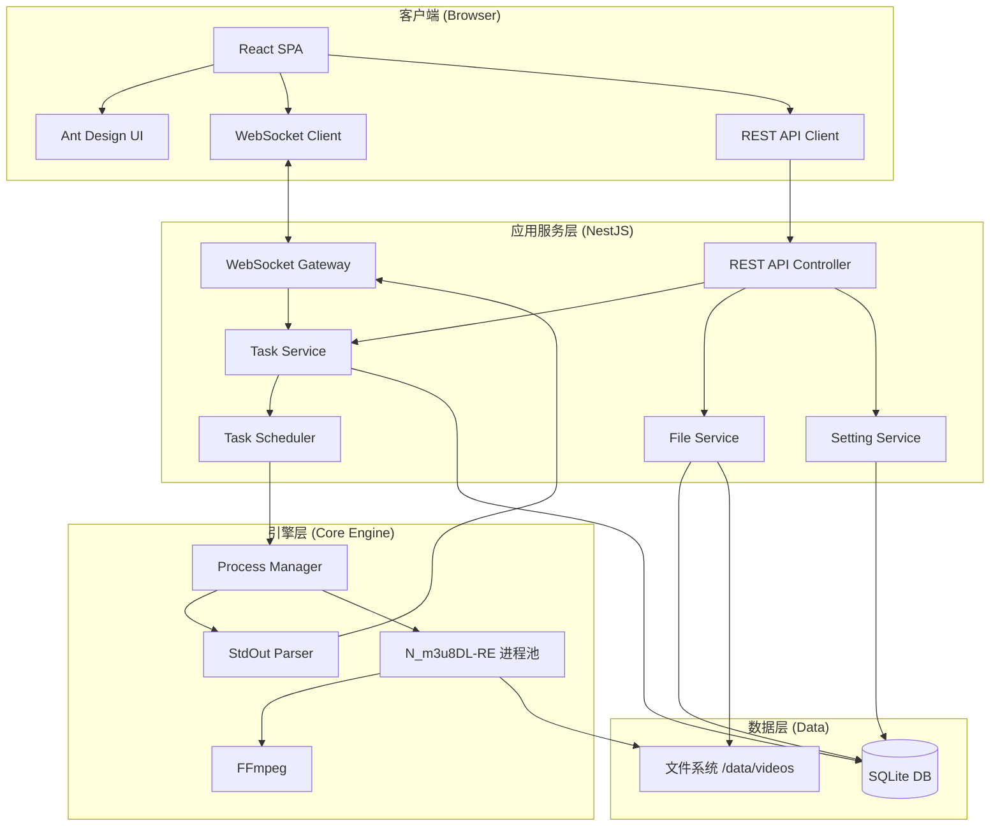
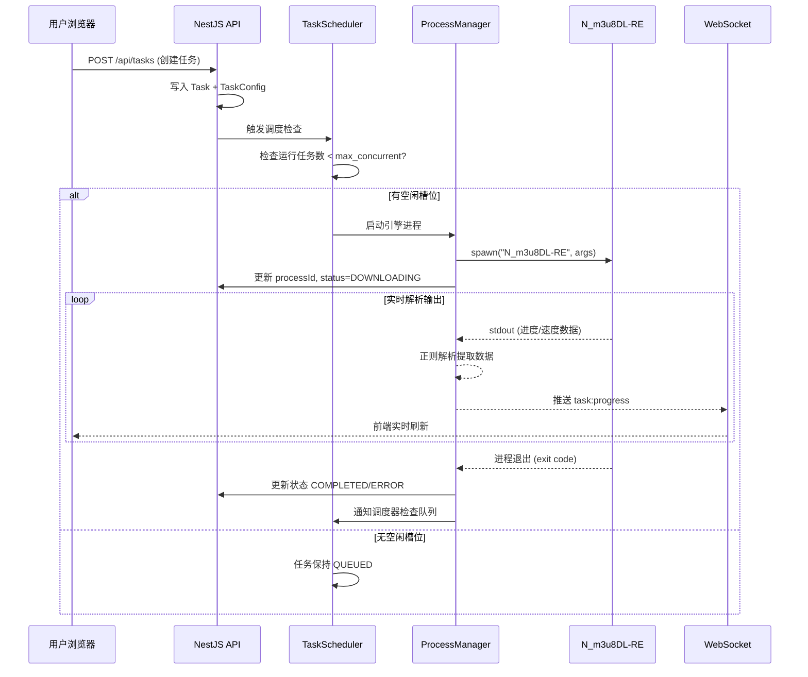
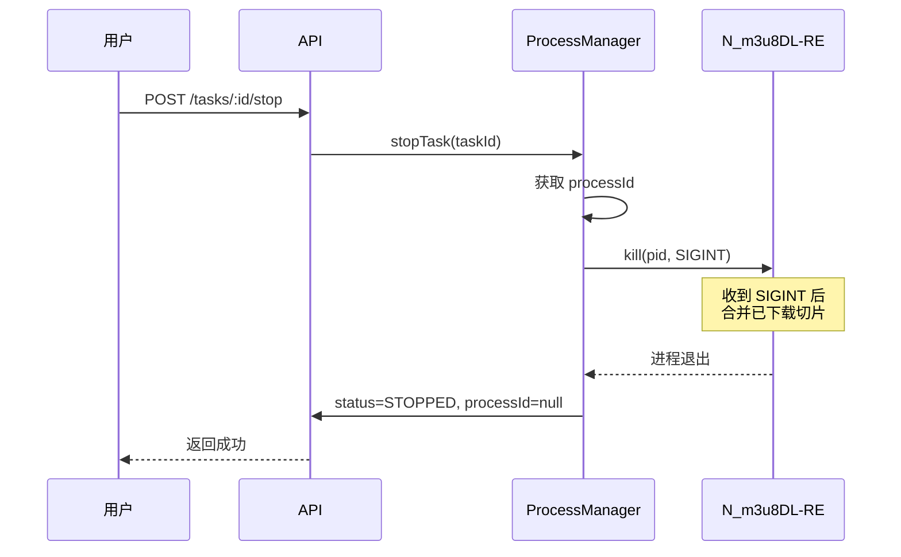
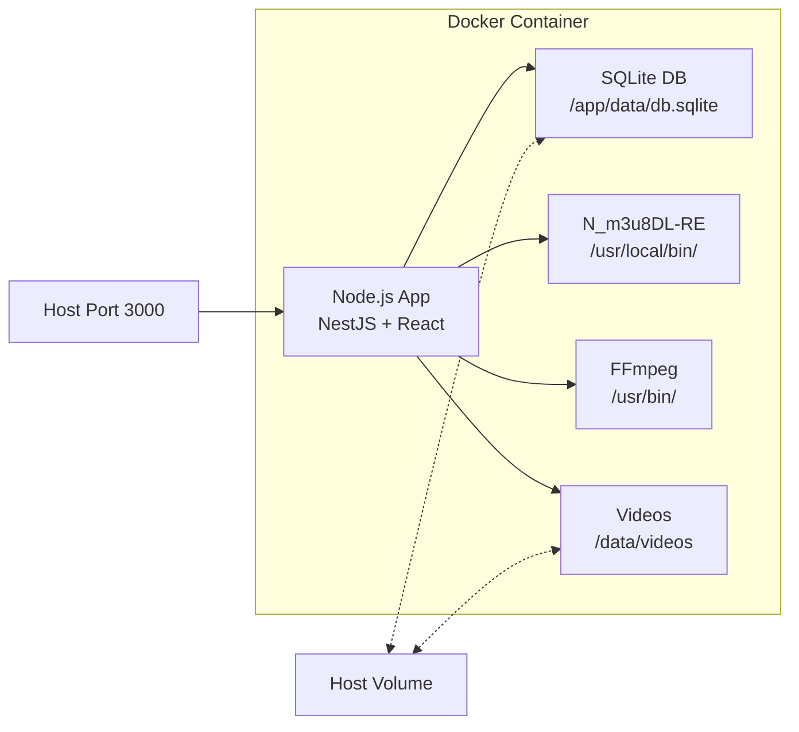
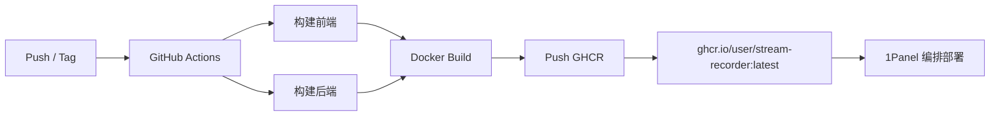

# 系统架构设计文档

## 1. 系统总览

Stream-Recorder Web UI 是基于 **N_m3u8DL-RE** 引擎构建的流媒体录制可视化控制台，采用前后端分离的现代 Web 架构。

---

## 2. 技术栈选型

| 层级 | 技术 | 版本 | 选型理由 |
|---|---|---|---|
| **前端框架** | React 18 | ^18.2 | 生态成熟、Hooks 模型适合实时数据 |
| **UI 组件库** | Ant Design 5 | ^5.x | 企业级组件丰富、暗色主题原生支持 |
| **CSS 方案** | TailwindCSS | ^3.4 | 原子化 CSS，快速构建现代布局 |
| **状态管理** | Zustand | ^4.x | 轻量级、适合 WebSocket 实时状态 |
| **构建工具** | Vite | ^5.x | 极速 HMR，优秀的 TypeScript 支持 |
| **后端框架** | NestJS | ^10.x | 模块化架构、内置 WebSocket、装饰器风格 |
| **ORM** | Prisma | ^5.x | 类型安全、Schema 优先、SQLite 原生支持 |
| **数据库** | SQLite | 3.x | 零配置、文件级、适合容器化单机部署 |
| **进程管理** | Node.js `child_process` | — | 管理 N_m3u8DL-RE 子进程生命周期 |
| **实时通信** | WebSocket (Socket.IO) | ^4.x | 双向实时推送任务进度 |
| **容器化** | Docker + Docker Compose | — | 一键部署，适配 1Panel 等管理面板 |

---

## 3. 系统架构图



---

## 4. 模块架构设计

### 4.1 后端模块划分 (NestJS)

```
src/
├── app.module.ts              # 根模块
├── main.ts                    # 入口 + 全局配置
│
├── task/                      # 任务管理模块
│   ├── task.module.ts
│   ├── task.controller.ts     # REST API: CRUD + 控制操作
│   ├── task.service.ts        # 业务逻辑
│   ├── task.gateway.ts        # WebSocket 网关 (进度推送)
│   └── dto/
│       ├── create-task.dto.ts
│       └── update-task.dto.ts
│
├── file/                      # 文件管理模块
│   ├── file.module.ts
│   ├── file.controller.ts     # REST API: 列表/预览/下载/删除
│   └── file.service.ts        # 文件系统操作
│
├── setting/                   # 系统设置模块
│   ├── setting.module.ts
│   ├── setting.controller.ts
│   └── setting.service.ts
│
├── engine/                    # 引擎管理模块
│   ├── engine.module.ts
│   ├── process-manager.ts     # 子进程生命周期管理
│   ├── stdout-parser.ts       # 终端输出正则解析
│   └── task-scheduler.ts      # 任务调度器 (并发控制)
│
├── system/                    # 系统监控模块
│   ├── system.module.ts
│   ├── system.controller.ts   # CPU/内存/磁盘接口
│   └── system.service.ts
│
├── prisma/                    # Prisma 数据库
│   ├── prisma.module.ts
│   ├── prisma.service.ts
│   └── schema.prisma
│
└── common/                    # 公共模块
    ├── filters/               # 全局异常过滤器
    ├── interceptors/           # 响应拦截器
    └── utils/                 # 工具函数
```

### 4.2 前端模块划分 (React)

```
src/
├── App.tsx                    # 根组件 + 路由
├── main.tsx                   # 入口
├── index.css                  # 全局样式
│
├── layouts/
│   └── MainLayout.tsx         # 左侧边栏 + 顶栏 + 内容区
│
├── pages/
│   ├── Dashboard.tsx          # 仪表盘
│   ├── TaskList.tsx           # 任务列表
│   ├── TaskDetail.tsx         # 任务详情 (视频预览 + 终端输出)
│   ├── VideoLibrary.tsx       # 视频库
│   └── Settings.tsx           # 系统设置
│
├── components/
│   ├── Sidebar.tsx            # 侧边导航
│   ├── Header.tsx             # 顶栏状态
│   ├── TaskCreateModal.tsx    # 新建任务弹窗
│   ├── TaskTable.tsx          # 任务列表表格
│   ├── VideoGrid.tsx          # 视频网格卡片
│   ├── VideoPlayer.tsx        # 内置播放器
│   ├── TerminalOutput.tsx     # 终端输出面板 (N_m3u8DL-RE stdout)
│   ├── ProgressRing.tsx       # 环形进度条组件
│   ├── StatsCard.tsx          # 数据统计卡片
│   ├── StorageChart.tsx       # 存储饼图
│   └── ThemeToggle.tsx        # 主题切换
│
├── hooks/
│   ├── useWebSocket.ts        # WebSocket连接管理
│   ├── useTaskActions.ts      # 任务操作封装
│   └── useSystemInfo.ts       # 系统信息轮询
│
├── stores/
│   ├── taskStore.ts           # 任务状态管理
│   ├── settingStore.ts        # 设置状态
│   └── themeStore.ts          # 主题状态
│
├── services/
│   ├── api.ts                 # Axios 实例
│   ├── taskApi.ts             # 任务API
│   ├── fileApi.ts             # 文件API
│   └── settingApi.ts          # 设置API
│
└── types/
    ├── task.ts                # 任务类型定义
    ├── file.ts                # 文件类型定义
    └── setting.ts             # 配置类型定义
```

---

## 5. API 接口设计

### 5.1 任务管理 API

| 方法 | 路径 | 说明 |
|---|---|---|
| `POST` | `/api/tasks` | 创建录制任务（支持批量） |
| `GET` | `/api/tasks` | 获取任务列表（分页+筛选） |
| `GET` | `/api/tasks/:id` | 获取单个任务详情 |
| `DELETE` | `/api/tasks/:id` | 删除任务 |
| `POST` | `/api/tasks/:id/start` | 启动/恢复任务 |
| `POST` | `/api/tasks/:id/stop` | 停止任务 |
| `POST` | `/api/tasks/:id/retry` | 重试任务 |
| `POST` | `/api/tasks/batch` | 批量操作（启动/停止/删除） |

### 5.2 文件管理 API

| 方法 | 路径 | 说明 |
|---|---|---|
| `GET` | `/api/files` | 获取媒体文件列表 |
| `GET` | `/api/files/:id/stream` | 流式播放视频 |
| `GET` | `/api/files/:id/download` | 下载视频文件 |
| `DELETE` | `/api/files/:id` | 删除视频文件 |

### 5.3 系统 API

| 方法 | 路径 | 说明 |
|---|---|---|
| `GET` | `/api/system/info` | 获取系统状态 (CPU/内存/磁盘) |
| `GET` | `/api/settings` | 获取所有配置 |
| `PUT` | `/api/settings` | 批量更新配置 |

### 5.4 WebSocket 事件

| 事件 | 方向 | 数据 | 说明 |
|---|---|---|---|
| `task:progress` | Server→Client | `{taskId, progress, speed, fileSize}` | 实时进度推送 |
| `task:statusChange` | Server→Client | `{taskId, status, errorMessage?}` | 状态变更通知 |
| `system:stats` | Server→Client | `{cpu, memory, disk}` | 系统资源推送 (5s间隔) |

---

## 6. 核心流程设计

### 6.1 任务调度流程



### 6.2 停止任务流程



---

## 7. 部署架构

### 7.1 Docker 部署方案



### 7.2 docker-compose.yml 参考

```yaml
version: "3.8"
services:
  stream-recorder:
    build: .
    container_name: stream-recorder
    restart: unless-stopped
    ports:
      - "3000:3000"
    volumes:
      - ./data:/app/data          # SQLite 数据库持久化
      - /path/to/videos:/data/videos  # 视频文件存储
    environment:
      - DATABASE_URL=file:/app/data/db.sqlite
      - NODE_ENV=production
```

### 7.3 Dockerfile 参考

```dockerfile
FROM node:20-slim

# 安装 ffmpeg 和运行时依赖
RUN apt-get update && apt-get install -y \
    ffmpeg \
    wget \
    && rm -rf /var/lib/apt/lists/*

# 安装 N_m3u8DL-RE
RUN wget -O /usr/local/bin/N_m3u8DL-RE \
    https://github.com/nilaoda/N_m3u8DL-RE/releases/latest/download/N_m3u8DL-RE_linux-x64 \
    && chmod +x /usr/local/bin/N_m3u8DL-RE

WORKDIR /app
COPY package*.json ./
RUN npm ci --production
COPY . .
RUN npm run build

EXPOSE 3000
CMD ["node", "dist/main.js"]
```

---

## 8. 安全与性能考量

### 8.1 安全措施

| 领域 | 措施 |
|---|---|
| **URL 注入** | 校验输入 URL 格式，过滤非 HTTP(S) 协议 |
| **路径穿越** | 视频路径限制在 `saveDir` 范围内 |
| **进程安全** | `SIGINT` 优雅停止，避免 `SIGKILL` 产生脏数据 |
| **API 限流** | Rate Limit 防止恶意批量创建任务 |
| **文件下载** | 鉴权后生成临时下载 Token |

### 8.2 性能优化

| 场景 | 方案 |
|---|---|
| **WebSocket 推送** | 进度更新节流 (300ms 间隔)，减少浏览器渲染压力 |
| **数据库查询** | 合理索引 + 批量更新进度 (而非逐条) |
| **文件列表** | 分页加载 + 虚拟滚动 |
| **视频预览** | Range 请求分块传输，支持拖动进度条 |
| **大文件下载** | 流式传输 (Stream)，避免内存溢出 |

---

## 9. CI/CD — GitHub Actions 构建与发布

### 9.1 流程总览



### 9.2 工作流文件 `.github/workflows/build.yml`

```yaml
name: Build & Push Docker Image

on:
  push:
    tags: ["v*"]
  workflow_dispatch:

env:
  REGISTRY: ghcr.io
  IMAGE_NAME: ${{ github.repository }}

jobs:
  build:
    runs-on: ubuntu-latest
    permissions:
      contents: read
      packages: write

    steps:
      - name: Checkout
        uses: actions/checkout@v4

      - name: Setup Node.js
        uses: actions/setup-node@v4
        with:
          node-version: 20
          cache: npm

      - name: Install dependencies
        run: npm ci

      - name: Build frontend & backend
        run: npm run build

      - name: Setup Docker Buildx
        uses: docker/setup-buildx-action@v3

      - name: Login to GHCR
        uses: docker/login-action@v3
        with:
          registry: ${{ env.REGISTRY }}
          username: ${{ github.actor }}
          password: ${{ secrets.GITHUB_TOKEN }}

      - name: Docker meta
        id: meta
        uses: docker/metadata-action@v5
        with:
          images: ${{ env.REGISTRY }}/${{ env.IMAGE_NAME }}
          tags: |
            type=semver,pattern={{version}}
            type=semver,pattern={{major}}.{{minor}}
            type=raw,value=latest

      - name: Build and push
        uses: docker/build-push-action@v5
        with:
          context: .
          push: true
          platforms: linux/amd64,linux/arm64
          tags: ${{ steps.meta.outputs.tags }}
          labels: ${{ steps.meta.outputs.labels }}
          cache-from: type=gha
          cache-to: type=gha,mode=max
```

### 9.3 多架构 Dockerfile（生产版）

```dockerfile
FROM node:20-slim AS builder
WORKDIR /app
COPY package*.json ./
RUN npm ci
COPY . .
RUN npm run build

FROM node:20-slim
WORKDIR /app

# 安装 ffmpeg
RUN apt-get update && apt-get install -y ffmpeg wget ca-certificates && rm -rf /var/lib/apt/lists/*

# 自动下载 N_m3u8DL-RE（根据架构判断）
ARG TARGETARCH
RUN case "${TARGETARCH}" in \
      "amd64") ARCH="linux-x64" ;; \
      "arm64") ARCH="linux-arm64" ;; \
      *) echo "Unsupported arch: ${TARGETARCH}" && exit 1 ;; \
    esac && \
    wget -q -O /usr/local/bin/N_m3u8DL-RE \
      "https://github.com/nilaoda/N_m3u8DL-RE/releases/latest/download/N_m3u8DL-RE_${ARCH}" && \
    chmod +x /usr/local/bin/N_m3u8DL-RE

COPY --from=builder /app/dist ./dist
COPY --from=builder /app/node_modules ./node_modules
COPY --from=builder /app/package.json ./

EXPOSE 3000
VOLUME ["/app/data", "/data/videos"]
CMD ["node", "dist/main.js"]
```

---

## 10. 启动方式

本系统支持两种启动方式，满足 **本地开发** 和 **生产部署** 两种场景。

### 10.1 本地开发模式 (`npm run dev`)

适用于开发和调试阶段。

```bash
# 1. 克隆项目
git clone https://github.com/<user>/stream-recorder.git
cd stream-recorder

# 2. 安装依赖
npm install

# 3. 初始化数据库
npx prisma generate
npx prisma db push

# 4. 自动下载引擎（首次执行）
npm run setup:engine

# 5. 启动开发服务器（前后端同时热重载）
npm run dev
```

> **说明：**
> - 前端通过 Vite 提供热重载 (HMR)，默认端口 `5173`
> - 后端通过 NestJS 提供 API，默认端口 `3000`
> - `npm run dev` 使用 `concurrently` 同时启动前后端
> - 数据库文件位于 `./data/db.sqlite`

#### `package.json` 开发脚本参考

```json
{
  "scripts": {
    "dev": "concurrently \"npm run dev:backend\" \"npm run dev:frontend\"",
    "dev:backend": "nest start --watch",
    "dev:frontend": "vite",
    "build": "npm run build:frontend && npm run build:backend",
    "build:frontend": "vite build",
    "build:backend": "nest build",
    "setup:engine": "tsx scripts/setup-engine.ts",
    "start": "node dist/main.js"
  }
}
```

### 10.2 1Panel Docker 编排部署

适用于生产环境，通过 1Panel 面板使用 Docker Compose 编排部署 GitHub Container Registry (GHCR) 中的预构建镜像。

#### 1Panel 编排文件

```yaml
version: "3.8"
services:
  stream-recorder:
    image: ghcr.io/<user>/stream-recorder:latest
    container_name: stream-recorder
    restart: unless-stopped
    ports:
      - "3000:3000"
    volumes:
      - ./data:/app/data          # SQLite + 配置持久化
      - /opt/videos:/data/videos  # 视频存储 (按需修改路径)
    environment:
      - DATABASE_URL=file:/app/data/db.sqlite
      - NODE_ENV=production
      - TZ=Asia/Shanghai
    healthcheck:
      test: ["CMD", "curl", "-f", "http://localhost:3000/api/system/info"]
      interval: 30s
      timeout: 10s
      retries: 3
```

#### 1Panel 部署步骤

1. 在 1Panel 面板 → **容器** → **编排** → 新建编排
2. 粘贴上述 `docker-compose.yml` 内容
3. 修改 `image` 中的 `<user>` 为实际 GitHub 用户名
4. 修改视频存储路径 `/opt/videos` 为宿主机实际路径
5. 点击 **部署** 即可启动
6. 后续更新：修改 tag 或拉取 `latest` 后重新部署

---

## 11. 引擎自动下载机制

系统启动时和手动触发时，自动检测当前操作系统和架构，并下载对应的 N_m3u8DL-RE 可执行文件。

### 11.1 支持平台与目标资产

| 平台 | 架构 | 运行时类型 | 资产 token | 包格式 |
|---|---|---|---|---|
| Linux | x64 | glibc | `linux-x64` | `.tar.gz` |
| Linux | x64 | musl | `linux-musl-x64` | `.tar.gz` |
| Linux | arm64 | glibc | `linux-arm64` | `.tar.gz` |
| Linux | arm64 | musl | `linux-musl-arm64` | `.tar.gz` |
| macOS | x64 | - | `osx-x64` | `.tar.gz` |
| macOS | arm64 | - | `osx-arm64` | `.tar.gz` |
| Windows | x64 | - | `win-x64` | `.zip` |
| Windows | arm64 | - | `win-arm64` | `.zip` |

### 11.2 下载入口 `scripts/setup-engine.ts`

- `npm run setup:engine`：检测本地是否已有可执行文件，存在且可执行则直接复用
- `npm run setup:engine -- --force`：强制重装最新 release
- 实际安装逻辑统一在 `src/server/engine/engine-installer.ts`，CLI 与后端自动安装共用

```typescript
// scripts/setup-engine.ts (simplified)
const target = resolveReleaseTarget(); // OS/arch/musl -> asset token
const result = await installEngineForCurrentPlatform({
  binDir: path.join(process.cwd(), 'bin'),
});
console.log(result.assetName, result.binaryPath);
```

### 11.3 运行时引擎路径解析

后端启动时按以下优先级查找引擎：

1. **系统设置表** `SystemSetting` 中的 `engine.n_m3u8dl_path` 配置
2. **项目 `bin/` 目录** 中通过 `setup:engine` 下载的本地副本
3. **系统 PATH** 中全局安装的 `N_m3u8DL-RE`

```typescript
// engine/engine-resolver.ts
function resolveEnginePath(): string {
  const configPath = settingService.get('engine.n_m3u8dl_path');
  if (configPath && fs.existsSync(configPath)) return configPath;

  const localBin = path.join(process.cwd(), 'bin',
    process.platform === 'win32' ? 'N_m3u8DL-RE.exe' : 'N_m3u8DL-RE');
  if (fs.existsSync(localBin)) return localBin;

  // Fallback: rely on system PATH
  return 'N_m3u8DL-RE';
}
```
